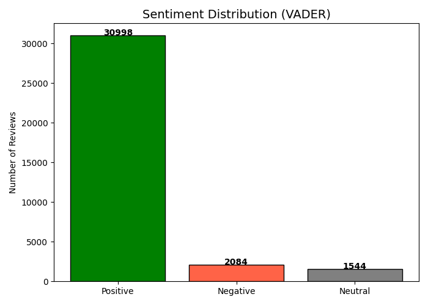
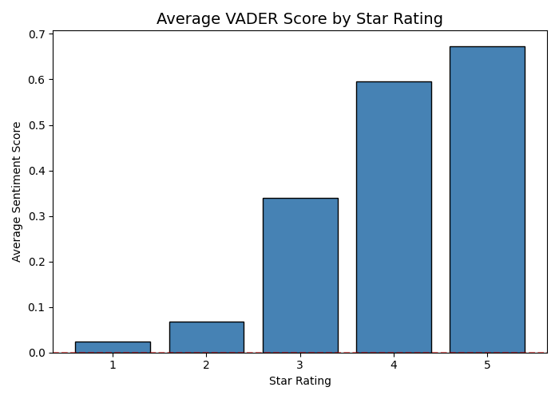
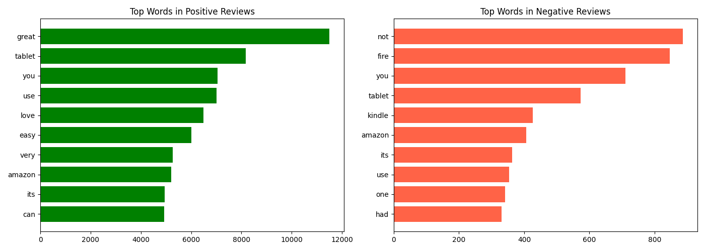

## E-Commerce Customer Review Sentiment Analysis

Performed sentiment analysis on Amazon product reviews using NLTK's 
VADER model and a Naive Bayes classifier.

**Tools:** Python, Pandas, NLTK, Scikit-learn, Matplotlib  
**Dataset:** Datafiniti Amazon Consumer Reviews (Kaggle)

### Approach
- Applied VADER lexicon-based sentiment scoring on raw review text
- Built Naive Bayes classifier achieving 83%+ accuracy
- Visualised sentiment distribution and most common words by sentiment

### Charts

